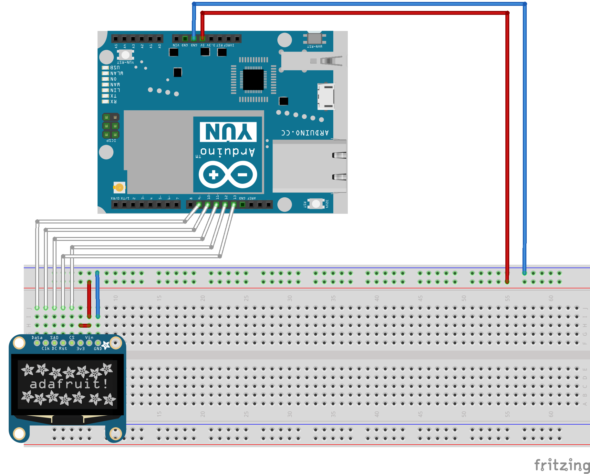
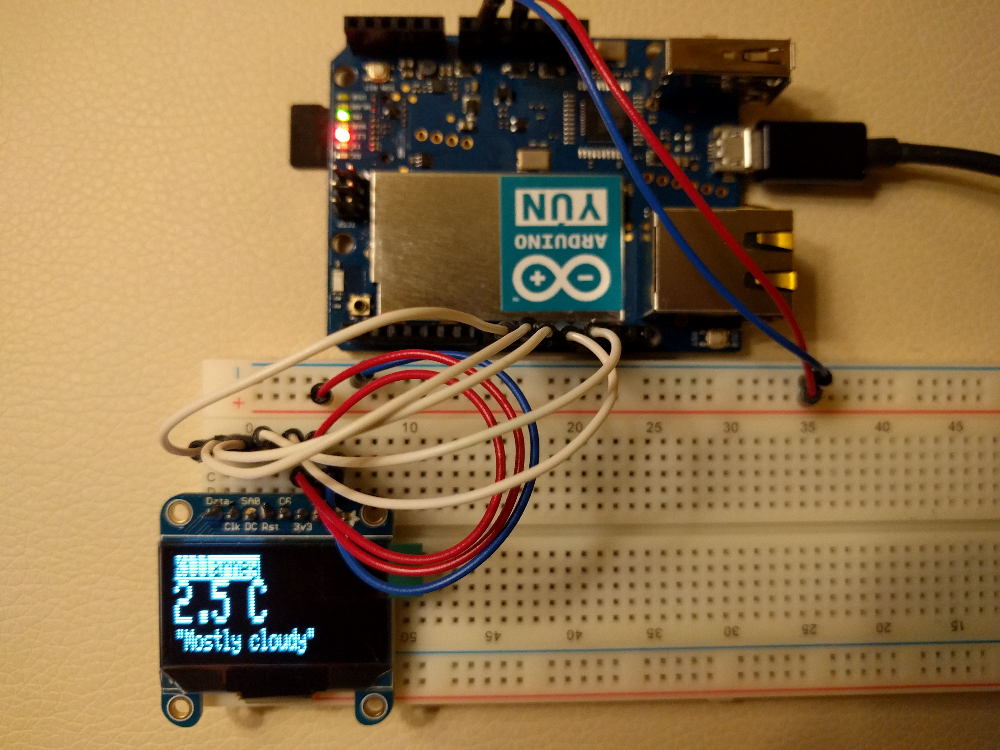

Weather info on LCD via Arduino UNO
======================================

**What?**

Program fetches information from Accuweather REST API url and displays it on connected 128x32 LCD display.

API docs: [http://apidev.accuweather.com/developers/currentConditionsAPI](http://apidev.accuweather.com/developers/currentConditionsAPI)

**Parts**

- Arduino UNO
- USB cable
- LCD display (Adafruit_SSD1306), size 128x32
- Male to Male Breadboard Jumper Cable Wires x 10
- Breadboard

**Code**

Source code in `main` needs to be uploaded to the board. Required libraries included in `lib` folder 
which need to be imported via Arduino IDE.

